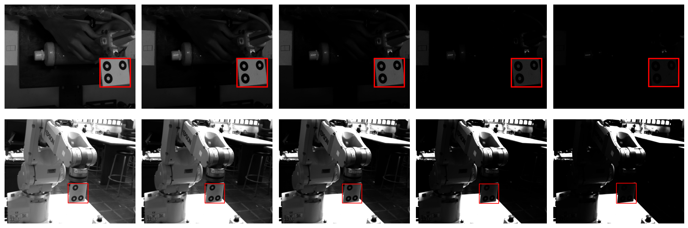

# Real-time marker detection through bounding box regression with LibTorch

Real-time bounding box regression based on ResNet18 using LibTorch. OpenCV and LibTorch are required dependencies. In addition, optionally TorchVision can be used if available. In case it is not available, ResNet model from `model` folder is used. This model is taken from [TorchVision repository](https://github.com/pytorch/vision/blob/master/torchvision/csrc/models/resnet.cpp). The marker detector is robust to poor lighting conditions, as can be seen in the following figure:

## Run

* Clone this repository: `git clone https://github.com/jhacsonmeza/CNN-MarkerDetect.git` 
* `cd CNN-MarkerDetect`
* `mkdir build && cd build`
* If you have TorchVision available run: `cmake -DCMAKE_PREFIX_PATH="path/to/LibTorch;path/to/TorchVision" ..`, otherwise run: `cmake -DCMAKE_PREFIX_PATH=path/to/LibTorch ..`
* `cmake --build .`
* `./train`