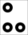

# Real-time marker detection through bounding box regression with LibTorch

Real-time bounding box regression based on ResNet18 using LibTorch. OpenCV and LibTorch are required dependencies. In addition, optionally TorchVision can be used if available. In case it is not available, ResNet model from `model/` folder is used. This model is taken from [TorchVision repository](https://github.com/pytorch/vision/blob/master/torchvision/csrc/models/resnet.cpp). The marker detector is robust to poor lighting conditions, as can be seen in the following figure:

## Target
An example of the target is shown below.

    

In the `images/` folder, there is a PNG and SVG version of the marker.

## How to use

* Clone this repository: `git clone https://github.com/jhacsonmeza/CNN-MarkerDetect.git` 
* `cd CNN-MarkerDetect`
* `mkdir build && cd build`
* If you have TorchVision available run: `cmake -DCMAKE_PREFIX_PATH="path/to/LibTorch;path/to/TorchVision" ..`, otherwise run: `cmake -DCMAKE_PREFIX_PATH=path/to/LibTorch ..`
* `cmake --build .`

### Training

For training download ResNet18 pretrained weights [here](https://drive.google.com/file/d/1GhMLLNvJqhgsdrE2zNuTF7kRwCRFSUe6/view?usp=sharing) into the `CNN-MarkerDetect` folder. Then, into the `CNN-MarkerDetect/build/` folder run: `./train`. During training for image data augmentation, the following operations are performed randomly: vertical and horizontal flip, translation, scaling, and brightness modifications. Furthermore, intersection over union (IoU) is used as an accuracy metric during training.

### Inference: real-time detection

Download the weights of the model [here](https://drive.google.com/file/d/1B4WGW0mOWbw5i6YFkDa0a_G5iCqksHkw/view?usp=sharing) into the cloned `CNN-MarkerDetect` folder. Also, and for a fast test, download the target image in your mobile device, which is in the `images/` folder. Then, in the `CNN-MarkerDetect/build/` location run `./realtime`. This snippet of code will use the webcam of your computer for target detection. With `ESC` you can stop the video acquisition. The above is an example running in CPU.

    

